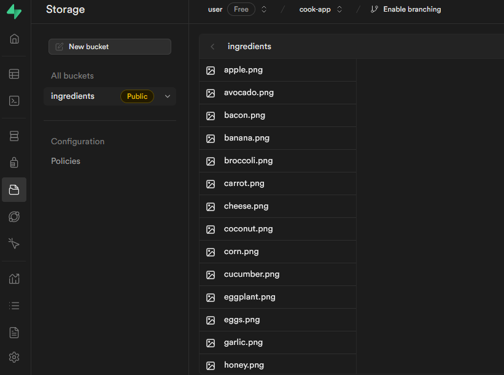

<p align="left">

  
  

  

</p>

### Tópicos

:small_blue_diamond: [Sobre o Projeto](#star-sobre-o-projeto)

:small_blue_diamond: [Objetivo](#dart-objetivo)

:small_blue_diamond: [Imagens](#sunrise_over_mountains-imagens)

:small_blue_diamond: [Funcionalidades](#bookmark_tabs-funcionalidades)

:small_blue_diamond: [Como rodar a aplicação](#arrow_forward-como-rodar-a-aplicação)

:small_blue_diamond: [Backlog](#dart-backlog)

## :star: Sobre o Projeto

Aplicação desenvolvida durante o evento React Native na Prática, evento gratuito organizado pelo Rocketseat (https://www.rocketseat.com.br/).

Este projeto foi desenvolvido utilizando:

:heavy_check_mark: Expo

:heavy_check_mark: React Native

:heavy_check_mark: Supabase como Banco de Dados

## :dart: Objetivo

Desenvolvimento de uma aplicação para sugestão de receitas, como base nos ingredientes selecionados.

## :bookmark_tabs: Funcionalidades

:white_check_mark: Seleção de Ingredientes

:white_check_mark: Listagem das Receitas disponíveis com os ingredientes selecionados

## :sunrise_over_mountains: Imagens

<details>
<summary> Imagens da Aplicação </summary>


</details>

## :arrow_forward: Como rodar a aplicação

#### :heavy_check_mark: Clonando o Projeto

- No terminal, clone o projeto:

  ```
  https://github.com/dgo-angelo/react-native-na-pratica-cook.git
  ```

### :arrow_forward: Executando a aplicação

- Acessar a pasta raiz do projeto e instalar as dependencias através do comando:

```
npm install
```

- Após instalar as dependencias, será necessário criar um novo projeto no Supabase e suas tabelas:


- Criar um novo Storage no Supabase para Upload das Imagens que serão utilizadas pelo projeto



- No arquivo \src\services\index.tsx, preencher o caminho do storage em "imagePath"

```typescript
import * as recipes from './recipesService';
import * as ingredients from './ingredientsService';
import * as preparations from './preparationsService';

export const services = {
  recipes,
  ingredients,
  preparations,

  storage: {
    imagePath: 'https://caminho/storage/v1/object/public/ingredients',
  },
};
```

- Para retorno das receitas foi utilizada uma função.


```sql
BEGIN
    RETURN QUERY
    SELECT
        recipes.id,
        recipes.name,
        recipes.minutes,
        recipes.image
    FROM
        recipe_ingredients
    INNER JOIN
        recipes ON recipe_ingredients.recipe_id = recipes.id
    WHERE
        recipe_ingredients.ingredient_id = ANY(ids)
    GROUP BY recipes.id;
END;
```

- Criar e preencher do arquivo .env

.env

```
EXPO_PUBLIC_SUPABASE_URL="PREENCHER COM A URL DO SUPABASE"
EXPO_PUBLIC_SUPABASE_ANON_KEY="PREENCHER COM A CHAVE DO SUPABASE"
```

- Após executar os procedimentos acima, é só iniciar o projeto em um emulador ou dispositivo físico.

```
npm start
```

<hr/>
